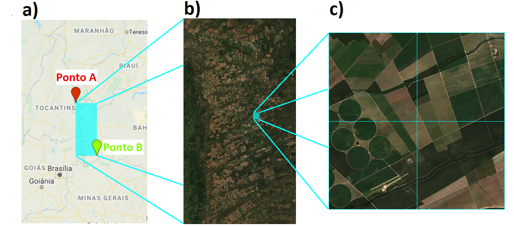
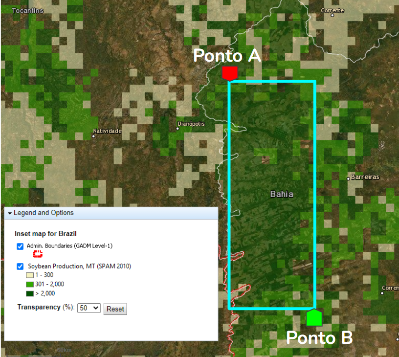
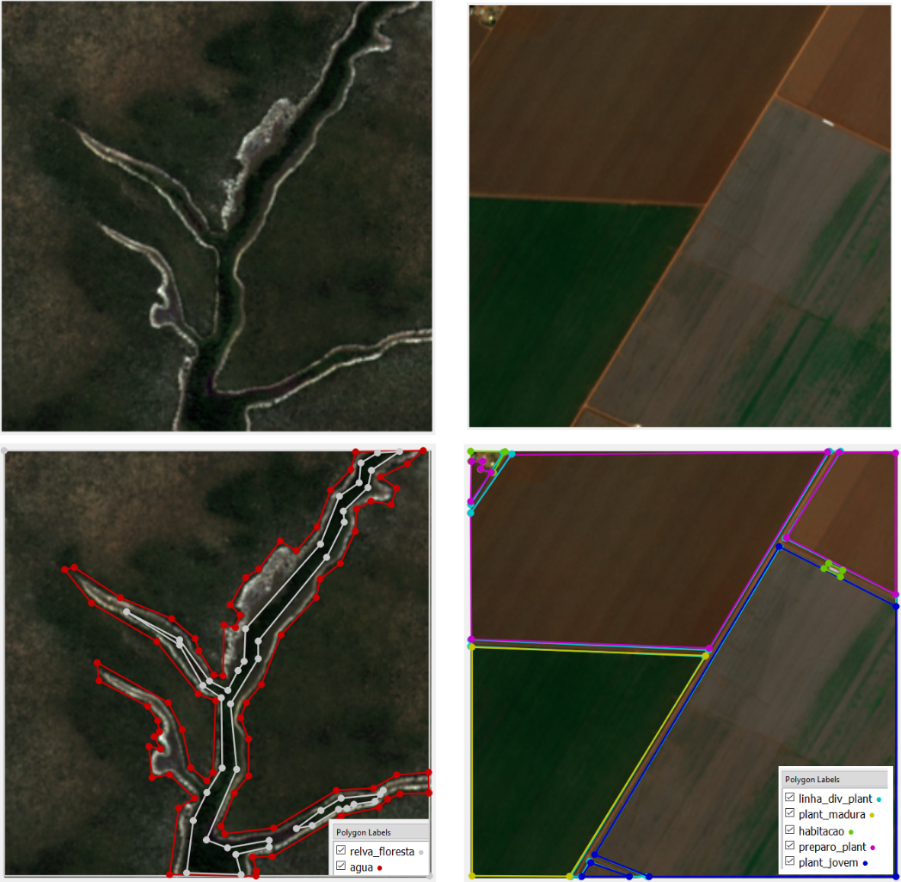
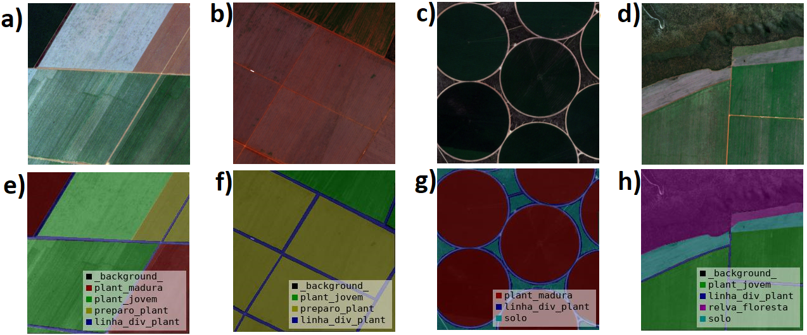

# AgriVis Dataset
Dataset com imagens do satélite Sentinel-2 de regiões de plantações do Norderte Brasileiro e aberto para colaboração


## Dataset

### Download
Disponível para download [neste link.](https://drive.google.com/drive/folders/1B1EUAo5_-6Kdl_az3tkn-hICF720wQJY?usp=sharing)

### Região de aquisição das imagens
a) Região de Aquisição. b) Imagem inteira. c) 4 blocos de imagem.
 

### Concentração de plantações na região de aquisição
Concentração de plantação de soja na Região de Estudo.


### Anotação das imagens
Exemplos de anotação das imagens com o Labelme. As imagens à esquerda
são de uma área de vegetação sem plantação e apresentam as classes Relva
ou Floresta e Água. As imagens à direita são de uma área de plantação e
apresentam todas as demais classes.

<br/><br/>

a), b), c) e d) são imagens em RGB do conjunto de dados e e), f), g) e h) são,
respectivamente, suas anotações.


## Citações:
International Conference on Image Analysis and Processing <br/>
Image Analysis and Processing – ICIAP 2022 pp 346–357, Disponível em https://link.springer.com/chapter/10.1007/978-3-031-06427-2_29.
```BibTex
@inproceedings{dos2022two,
  title={A Two-Stage U-Net to Estimate the Cultivated Area of Plantations},
  author={dos Santos Oliveira, Walysson Carlos and Braz Junior, Geraldo and Lima Gomes Junior, Daniel and Cardoso de Paiva, Anselmo and Sousa de Almeida, Joao Dallyson},
  booktitle={International Conference on Image Analysis and Processing},
  pages={346--357},
  year={2022},
  organization={Springer}
}
```
